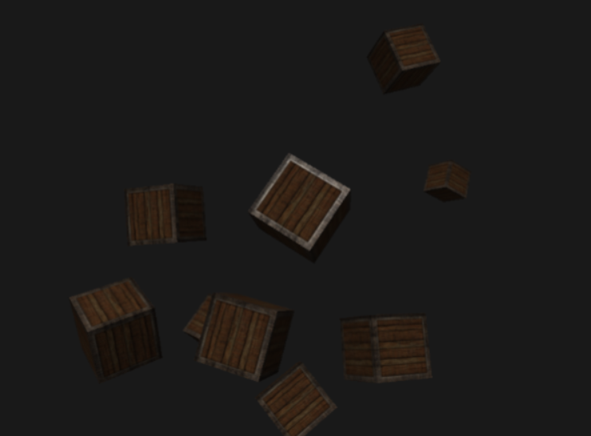

# Computer Graphics

## Introduction and Context

For our module GPR5300, we had to create a 3D scene using OpenGL. The goal was to understand the functioning of the main features that make a scene.

To do so, we used OpenGL ES (Embedded System) 3.0, which allows us to run our program on multiple platforms. We also created the engine and the window with the SDL window API.

To create this scene, I followed the tutorials provided by [LearnOpenGL](https://learnopengl.com). You can find all the features that I will talk about on the website as well as in-depth explanations for each of them.

In this blogpost, I will explain the features that figure in my scene and the steps to implement them.

## Displaying a Triangle

The very first step was to display a triangle on the scene. To draw anything on the screen, **we need a vertex shader, and a fragment shader:**

```glsl
#version 310 es
precision highp float;

out vec3 fragColor;

// Give our vertices positions
vec2 positions[3] = vec2[](
        ...
);

// Give the colors at each vertex
vec3 colors[3] = vec3[](
        ...
);


void main() {
    // Set the positions and send the color to the Fragment shader
    gl_Position = vec4(positions[gl_VertexID], 0.0, 1.0);
    fragColor = colors[gl_VertexID];
}
```

 *<center> Vertex shader </center>*


 ```glsl
 #version 310 es
precision highp float;

in vec3 fragColor;

layout(location = 0) out vec4 outColor;


void main() {
    // Set the color for each pixel
    outColor = vec4(fragColor, 1.0);
}
```
 *<center> Fragment shader </center>*
 
 ---
 Now that our shaders are written, we need to compile them and bind them to our program, and draw our triangle between the clear and the swap, which gives us this result:

 <div align="center">
 
 </div>

 We can now create colored shapes in our scene, in this example our triangle was in 2D, but we can create cubes and other shapes in 3D, and add textures to them.

## Creating lights

To add some realism to our scene we can create lights that will affect the way our objects appear and make them look brighter or darker.

In my scene, I used the **Blinn-Phong** shading model, which uses light maps to simulate lighting (diffuse & specular), and uses a halfway vector instead of a reflection vector between the view direction and the light direction to compare it to the normal. The closer the halfway is to the normal, the higher the specular will contribute.

<div align="center">
 
 <p><em> Phong Model </em></p>
 </div>

---
<div align="center">
 
 <p><em> Blinn-Phong Model </em></p>
 </div>

There are many types of lights we can use in our scene, in my case, I used a directional light for my final scene, which simulates a light source with no position and only a direction.

To implement a directional light, or any type of light, we first need to create a structure for our light and for our material in the fragment shader:

```glsl
struct DirLight {
    vec3 direction;
    vec3 ambientStrength;
    vec3 diffuseStrength;
    vec3 specularStrength;
    };

struct Material{
    sampler2D diffuseMap;
    sampler2D specularMap;
    float shininess;
};
```

After adding those two elements, we can then calculate the lighting inside our main function:

```glsl
void main()
{ 
    // Normalize the light's direction
     vec3 lightDir = normalize(-light.direction);

    // Diffuse calculation
    float diff = max(dot(normal, lightDir), 0.0);

    // Specular calculation
    vec3 reflectDir = reflect(-lightDir, normal);
    float spec = pow(max(dot(viewDir, reflectDir), 0.0), material.shininess);

    // Combine results
    vec3 ambient = light.ambientStrength * vec3(texture(material.diffuseMap, TexCoords));
    vec3 diffuse = light.diffuseStrength * diff * vec3(texture(material.diffuseMap, TexCoords));
    vec3 specular = light.specularStrength * spec * vec3(texture(material.specularMap, TexCoords));

    // Return final result
    result = ambient + diffuse + specular;
    FragColor = vec4(result, 1.0);
}
```

After implementing the lights correctly, our scene should look like this: 

<div align="center">
 
 </div>


## Loading a model

Playing around with cubes and triangles is fun, **but having 3D models is better**, which is why I implemented model loading into my scene. To do so, I used the [Assimp](https://github.com/assimp/assimp) library, 

## Post-Processing with Framebuffer

## Adding a Cubemap

## Instancing multiple models

## Normal mapping

## Features I couldn't implement

## Conclusion