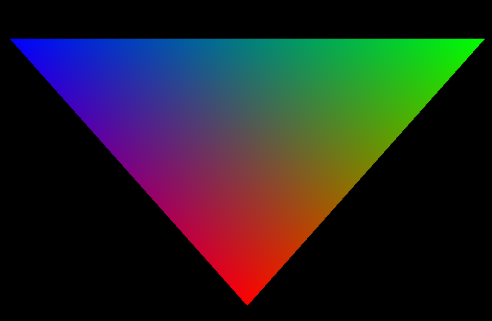

# Computer Graphics

## Introduction and Context

For our module GPR5300, we had to create a 3D scene using OpenGL. The goal was to understand the functioning of the main features that make a scene.

To do so, we used OpenGL ES (Embedded System) 3.0, which allows us to run our program on multiple platforms. We also created the engine and the window with the SDL window API.

In this blogpost, I will explain the features that figure in my scene and the steps to implement them.

## Displaying a Triangle

The very first step was to display a triangle on the scene. To draw anything on the screen, **we need a vertex shader, and a fragment shader:**

```glsl
#version 310 es
precision highp float;

out vec3 fragColor;

vec2 positions[3] = vec2[](
    vec2(-0.5, 0.5),
    vec2(0.5, -0.5),
    vec2(-0.5, -0.5)
);

vec3 colors[3] = vec3[](
    vec3(1.0, 0.0, 1.0),
    vec3(1.0, 0.0, 1.0),
    vec3(1.0, 0.0, 1.0)
);

void main() {
    gl_Position = vec4(positions[gl_VertexID], 0.0, 1.0);
    fragColor = colors[gl_VertexID];
}
```

 *<center> Vertex shader </center>*


 ```glsl
 #version 310 es
precision highp float;

in vec3 fragColor;

layout(location = 0) out vec4 outColor;

void main() {
    outColor = vec4(fragColor, 1.0);
}
```
 *<center> Fragment shader </center>*
 
 ---
 Now that our shaders are written, we need to compile them and bind them to our program, and draw our triangle between the clear and the swap, which gives us this result:

 <p align="center">
 
 </p>


## Creating lights

## Loading a model

## Post-Processing with Framebuffer

## Adding a Cubemap

## Instancing multiple models

## Normal mapping

## An attempt at adding shadow mapping

## Conclusion