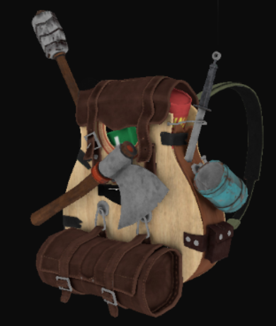
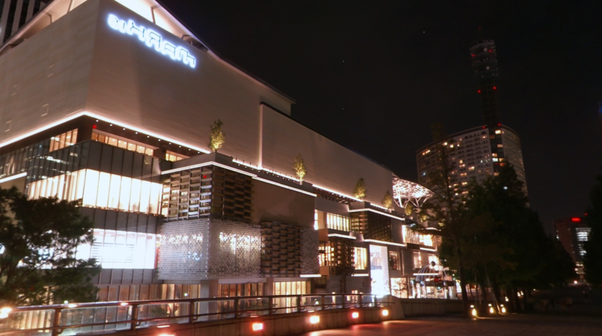

# Computer Graphics

## Introduction and Context

For our module GPR5300, we had to create a 3D scene using OpenGL. The goal was to understand the functioning of the main features that make a scene.

To do so, we used OpenGL ES (Embedded System) 3.0, which allows us to run our program on multiple platforms. We also created the engine and the window with the SDL window API.

To create this scene, I followed the tutorials provided by [LearnOpenGL](https://learnopengl.com). You can find all the features that I will talk about on the website as well as in-depth explanations for each of them.

In this blogpost, I will explain the features that figure in my scene and the steps to implement them.

## Displaying a Triangle

The very first step was to display a triangle on the scene. To draw anything on the screen, **we need a vertex shader and a fragment shader:**

```glsl
#version 310 es
precision highp float;

out vec3 fragColor;

// Give our vertices positions
vec2 positions[3] = vec2[](
        ...
);

// Give the colors at each vertex
vec3 colors[3] = vec3[](
        ...
);

void main() {
    // Set the positions and send the color to the Fragment shader
    gl_Position = vec4(positions[gl_VertexID], 0.0, 1.0);
    fragColor = colors[gl_VertexID];
}
```

 *<center> Vertex shader </center>*


 ```glsl
 #version 310 es
precision highp float;

in vec3 fragColor;

layout(location = 0) out vec4 outColor;

void main() {
    // Set the color for each pixel
    outColor = vec4(fragColor, 1.0);
}
```
 *<center> Fragment shader </center>*
 

 Now that our shaders are written, we need to compile them and bind them to our program, and draw our triangle between the clear and the swap, which gives us this result:

 <p align="center">
 <br>
 </p>

 
 We can now create colored shapes in our scene, in this example our triangle was in 2D, but we can create cubes and other shapes in 3D, and add textures to them.

## Creating lights

To add some realism to our scene we can create lights that will affect the way our objects appear and make them look brighter or darker.

In my scene, I used the **Blinn-Phong** shading model, which uses light maps to simulate lighting (diffuse & specular), and uses a halfway vector instead of a reflection vector between the view direction and the light direction to compare it to the normal. The closer the halfway is to the normal, the higher the specular will contribute.

<p align="center">
 
 <em> Phong Model </em>
 </p>

---
<p align="center">
 
 <em> Blinn-Phong Model </em>
 </p>

There are many types of lights we can use in our scene, in my case, I used a directional light for my final scene, which simulates a light source with no position and only a direction.

To implement a directional light, or any type of light, we first need to create a structure for our light and for our material in the fragment shader:

```glsl
struct DirLight {
    vec3 direction;
    vec3 ambientStrength;
    vec3 diffuseStrength;
    vec3 specularStrength;
    };

struct Material{
    sampler2D diffuseMap;
    sampler2D specularMap;
    float shininess;
};
```

After adding those two elements, we can then calculate the lighting inside our main function:

```glsl
void main()
{ 
    // Normalize the directions to calculate the halfway vector
    vec3 lightDir   = normalize(lightPos - FragPos);
    vec3 viewDir    = normalize(viewPos - FragPos);
    vec3 halfwayDir = normalize(lightDir + viewDir);

    // Diffuse calculation
    float diff = max(dot(normal, lightDir), 0.0);

    // Specular calculation with Blinn-Phong
    float spec = pow(max(dot(normal, halfwayDir), 0.0), material.shininess);

    // Combine results
    vec3 ambient = light.ambientStrength * vec3(texture(material.diffuseMap, TexCoords));
    vec3 diffuse = light.diffuseStrength * diff * vec3(texture(material.diffuseMap, TexCoords));
    vec3 specular = light.specularStrength * spec * vec3(texture(material.specularMap, TexCoords));

    // Return final result
    result = ambient + diffuse + specular;
    FragColor = vec4(result, 1.0);
}
```

After implementing the lights correctly, our scene should look like this: 

<p align="center">
<br>
</p>


We now have lights in our scene! 

## Loading a model

Playing around with cubes and triangles is fun, **but having 3D models is even more fun**, which is why I implemented model loading into my scene.

To do so, I used the [Assimp](https://assimp-docs.readthedocs.io/en/v5.1.0/) library, which allows us to easily load dozens of model file formats such as **.obj** which is the format that I am using in my scene. Assimp uses *aiNodes* to load the model from the file, which prevents us from doing it all in code.

But, that does not mean we don't have to code anything, in fact, we need to create two new classes for our model loading to work: Mesh & Model.

```glsl
class Mesh
	{
	public:
        // Initialize the Mesh and give it its attributes
		void InitMesh(std::vector<Vertex> vertices, std::vector<unsigned> indices, std::vector<Texture> textures);

        // Bind our texture to our Mesh
		void BindTexture(const Shader shader) const;

        // Draw our Mesh
		void Draw(const Shader& pipeline) const;

        // Delete the Mesh
		void Delete();

        // Variables
		std::vector<Vertex> vertices;
		std::vector<unsigned int> indices;
		std::vector<Texture> textures;
		unsigned int vao_{}, vbo_{}, ebo_{};

	private:
		void SetupMesh();
	};
```

 *<center> Mesh class </center>*

 ```glsl
 class Model
	{
	public:
        // Keeping a count of the textures we loaded
		std::vector<Texture> textures_loaded;
		
		void InitModel(const char* path);
		void Draw(const Shader& pipeline) const;
		void Delete();

        // Contains all the meshes inside the model
		std::vector<Mesh> meshes;

	private:
        // File directory
		std::string directory;

        // Load the model in the program with the directory
		void loadModel(const std::string& path);

        // Assimp functions
		void processNode(const aiNode* node, const aiScene* scene);
		Mesh processMesh(aiMesh* mesh, const aiScene* scene);
		std::vector<Texture> loadMaterialTextures(aiMaterial* mat, aiTextureType type,
			std::string typeName);
	};
 ```

 *<center> Model class </center>*

 The functions inside the Model class are going to iterate through each mesh, and get their vertices and indices. After that, we will be able to draw our model and display it on the screen. We will also be able to move it with translations or rotations, or even scaling:

 ```glsl
 Mesh processMesh(aiMesh *mesh, const aiScene *scene)
{
    vector<Vertex> vertices;
    vector<unsigned int> indices;
    vector<Texture> textures;

    for(unsigned int i = 0; i < mesh->mNumVertices; i++)
    {
        Vertex vertex;
        // Process vertex positions, normals and texture coordinates
        [...]
        vertices.push_back(vertex);
    }
    // Process indices
    [...]
    // Process material
    if(mesh->mMaterialIndex >= 0)
    {
        [...]
    }

    return Mesh(vertices, indices, textures);
} 
 ```

 Once we initialized and bound our model, and called the draw function inside our Update method, this is what we get:

 <p align="center">
<br>
</p>


Our model is correctly implemented in our scene! However the scene looks a bit empty...

## Adding a Cubemap

Having a completely black background can feel empty and lifeless. To change that, we can add a cubemap to our scene.

A cubemap is a texture that contains 6 2D textures that when combined, form a cube!
To implement it, we simply need to create it just like we would any textures, with the exception of using *GL_TEXTURE_CUBE_MAP* as a specifier in our *glBindTexture()* function:

```glsl
unsigned int cubemapTexture;
glGenTextures(1, &cubemapTexture);
glBindTexture(GL_TEXTURE_CUBE_MAP, cubemapTexture);
```

 We also can't forget that OpenGL gives us 6 special texture targets when it comes to the faces of a map: 

|Texture target|Orientation|
|---|---|
|GL_TEXTURE_CUBE_MAP_POSITIVE_X|Right|
|GL_TEXTURE_CUBE_MAP_NEGATIVE_X|Left|
|GL_TEXTURE_CUBE_MAP_POSITIVE_Y|Top|
|GL_TEXTURE_CUBE_MAP_NEGATIVE_Y|Bottom|
|GL_TEXTURE_CUBE_MAP_POSITIVE_Z|Back|
|GL_TEXTURE_CUBE_MAP_NEGATIVE_Z|Front|

Since a cubemap contains six 2D textures, we need to call *glTexImage2D()* 6 times:

```glsl
int width, height, nrChannels;
unsigned char *data;  
for(unsigned int i = 0; i < textures_faces.size(); i++)
{
    // Load our textures
    data = stbi_load(textures_faces[i].c_str(), &width, &height, &nrChannels, 0);
    glTexImage2D(GL_TEXTURE_CUBE_MAP_POSITIVE_X + i, 0, GL_RGB, width, height, 0, GL_RGB, GL_UNSIGNED_BYTE, data);
}
```

After loading our cubemap, we need to specify the faces, and create simple shaders that will display the cubemap:

```glsl
vector<std::string> faces;
{
    "right.jpg",
    "left.jpg",
    "top.jpg",
    "bottom.jpg",
    "front.jpg",
    "back.jpg"
};
```

One thing to note is that we need to make sure the cubemap is drawn on another cube that we created, with its own VAO and VBO.

We also need to make sure the cubemap is drawn after the scene. This helps us save some bandwidth since we don't need to draw on a pixel twice.

The last thing we need to be careful of is the cubemap's transformation matrix, indeed, we need to remove the translation matrix from our cubemap if we want it to stay still while we are moving:

```glsl
glm::mat4 view = glm::mat4(glm::mat3(camera.GetViewMatrix()));  
```

Our scene should now look more realistic:

 <p align="center">
<br>
</p>


Perfect! We gave our scene more life and more realism with this simple implementation.

## Post-Processing with Framebuffers

## Instancing multiple models

## Normal mapping

## Features I couldn't implement

## Conclusion