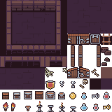
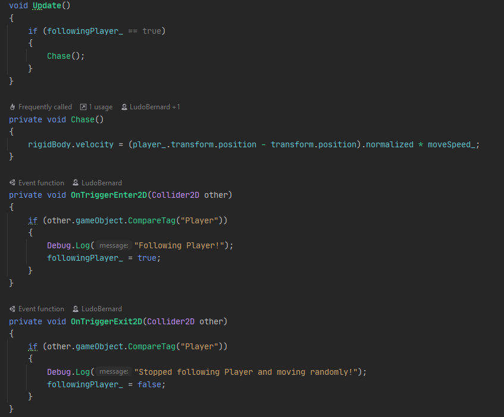
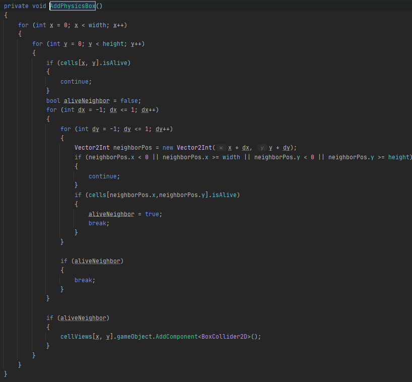

## Génération Procédurale et Intelligence Artificielle
## Introduction et contexte:
Pour le module GPR440, j'avais eu pour projet de développer un jeu avec la génération procédurale ainsi que l'intelligence artificielle. Le but de ce projet était de créer un jeu qui génère des caves procéduralement, avec des ennemis, et un objectif à trouver.

## Les problèmes rencontrés lors du développement:
### L'implémentation de la génération procédurale:
Au départ, j'avais envie d'utiliser le Binary Space Partitioning (BSP) pour créer des niveaux procéduralement, ressemblant à un bâtiment ou une sorte de laboratoire. Cependant, après avoir remarqué la difficulté de cette méthode, j'ai opté pour une méthode plus simple, le **Cellular Automata**, ce qui a donné naissance à un nouveau de type de niveau: une cave.
### Trouver des assets pour les ennemis/l'environnement:
Ayant une idée claire des types d'ennemis que je voulais ajouter, j'au eu beaucoup de mal à trouver des assets correspondants à ces derniers. Mais après quelques heures de recherche, j'ai réussi à trouver deux monstres: Un slime bleu, et un squelette, les deux suivant le joueur, mais à des vitesses différentes.

Et pour l'environnement, j'ai trouvé des sprites de donjons, mais je n'ai pas utilisé les murs, les murs sont donc invisibles.

### Les ennemis qui suivent le joueur:
J'ai implémenté le "chasing" pour les ennemis. J'ai ajouté un circle collider 2D aux ennemis avec un certain rayon, en IsTrigger, puis j'ai vérifié sur le joueur était dans ce rayon, et si c'était le cas, alors l'ennemis se mettait à suivre le joueur jusqu'à ce qu'il sorte du rayon.

J'ai fait le choix de ne pas implémenter le Pathfinding car je voulais me concentrer sur le Cellular Automata, mais aussi car cette solution me convenait assez bien.

### Ajouter des murs/colliders au donjon:
Grâce au cours, j'ai réussi (pas seul) à implémenter l'ajout de Colliders sur les cellules mortes qui sont autour des cellules vivantes.

## Conclusion: 
Pour conclure, ce projet n'était vraiment pas facile à créer, il manque beaucoup de choses, telles que des sons, certaines animations, des mécaniques, des assets...
Ce projet m'a appris beaucoup de choses, mais surtout dans la génération procédurale, car l'IA n'était pas énormément traitée dans ce jeu, même si c'était dans les consignes.
Et malgré le manque de motivation, ou la peur de l'inconnu, il est important de toujours surmonter ces épreuves car elles nous apprennent des choses importantes.
